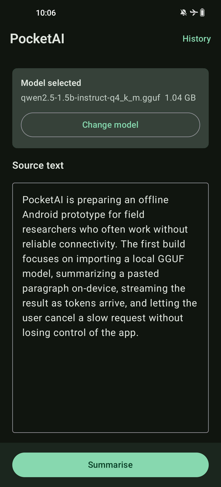
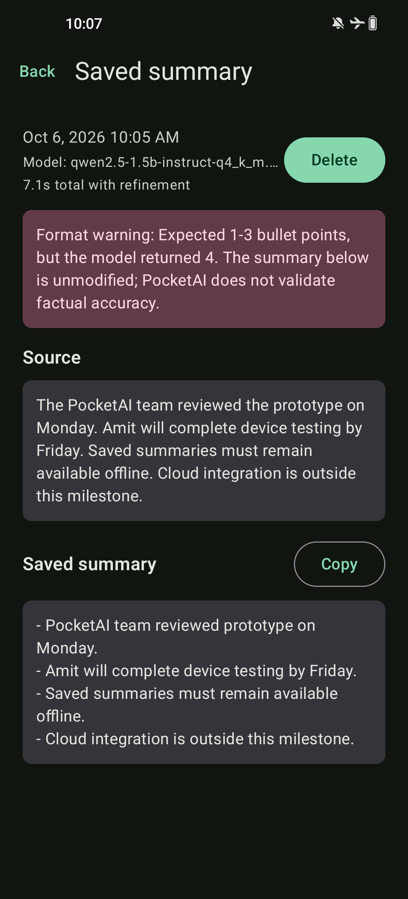
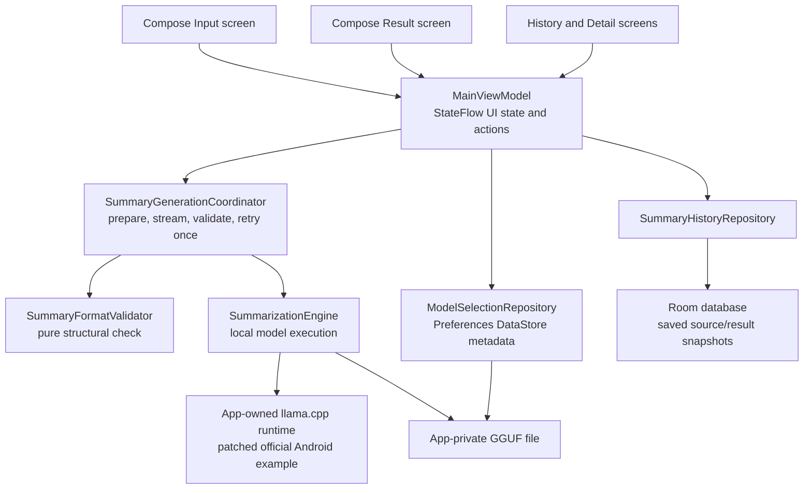

# PocketAI

PocketAI is an offline Android summarisation MVP. It imports a user-downloaded GGUF model, runs llama.cpp locally on the phone, streams a short bullet summary, and lets the user explicitly save completed summaries for later reading.

The current prototype targets a OnePlus 8 Pro / IN2021 with 12 GB RAM on Android 13. It is a focused engineering prototype, not a production app. The model is downloaded separately and imported by the user; after that, inference runs locally without cloud inference or login.

## Screenshots

These are real device screenshots from Task 007C acceptance on a OnePlus IN2021 / Android 13 using non-personal test text.

| Remembered model on Input | Saved summary detail |
| --- | --- |
|  |  |

A completed Result-screen screenshot was not captured. ADB screenshot execution was blocked after the post-relaunch summary completed, so the acceptance report records that result through the UI hierarchy, logs, and observed elapsed time instead of a screenshot.

## Main Capabilities

- Separate Compose Input and Result screens for editing and reading.
- Local CPU inference through the official llama.cpp Android example.
- Qwen/Qwen2.5-1.5B-Instruct-GGUF with `qwen2.5-1.5b-instruct-q4_k_m.gguf`.
- Correct Qwen chat-template formatting through llama.cpp's Jinja chat formatter.
- User imports the downloaded GGUF through Android's file picker; the app copies it to app-private storage.
- Remembered model selection with Preferences DataStore, then load-on-demand when summarisation starts.
- Streaming output, elapsed time, cancellation, and a guarded fresh request after cancellation.
- Runtime tokenizer-based input-budget validation for the 2048-token context.
- Bounded summary-format retry: validate 1-3 bullets, retry once, and warn if the retry still does not match.
- Explicit saved summaries with Room: History list, saved detail, Copy, and Delete.
- No bundled model files and no app-declared `INTERNET` permission in the verified debug build.

## How It Works



Four design decisions matter most:

- **Application-owned native runtime versus screen state:** `PocketAiContainer` owns the llama.cpp runtime for the app process. The ViewModel cancels requests and owns UI/session state, but ViewModel disposal does not destroy the upstream native singleton.
- **Durable model selection versus loaded RAM state:** DataStore remembers only the app-private filename, display name, and size. It does not store a `Ready` flag. Startup can show a selected model on disk without loading native inference, and the first summary loads it on demand.
- **Structural validation versus semantic evaluation:** the validator checks only bullet shape: 1-3 non-empty bullet items with no extra prose. It does not prove factual accuracy. Quality is handled by rubric-based manual evaluation cases.
- **Immutable saved snapshots:** saving stores the completed request's source snapshot, exact final summary, duration, refinement flag, warning, and available model identification. It does not save whatever text happens to be in the editor later.

See [ARCHITECTURE.md](ARCHITECTURE.md) for implementation details.

## Setup, Build, And Run

### Requirements

- JDK 17.
- Android SDK with compile SDK 36 and target SDK 36 support.
- Android NDK `29.0.13113456`.
- CMake `3.31.6`.
- Gradle wrapper `8.14.3`.
- Android Gradle Plugin `8.13.2`.
- Kotlin `2.3.0`.
- A physical or virtual Android device at API 33 or newer for install/testing. The current target is arm64-v8a.

### Native Runtime Setup

PocketAI uses the official llama.cpp Android example at a pinned revision:

- Upstream path: `examples/llama.android`
- Commit: `1537a0a8b2f8711d840878b0a0677ab2213c882c`
- Reference: `https://github.com/ggml-org/llama.cpp/tree/1537a0a8b2f8711d840878b0a0677ab2213c882c/examples/llama.android`

The checkout under `work/llama.cpp` is generated local state and is not the source of truth. Recreate it from the pinned commit and tracked patch:

```sh
./scripts/setup-llama-cpp.sh
```

The script clones or reuses llama.cpp, checks out the pinned commit, and applies [patches/llama-cpp-pocketai.patch](patches/llama-cpp-pocketai.patch). The patch adds the prototype-specific Android hooks: 2048-token context, Qwen chat-template formatting, per-request state reset, tokenizer-based prompt counting, cancellation, and recoverable cleanup around failed loads.

### Model

Download this exact GGUF separately:

https://huggingface.co/Qwen/Qwen2.5-1.5B-Instruct-GGUF/resolve/main/qwen2.5-1.5b-instruct-q4_k_m.gguf

Do not commit the model, place it in `assets/` or `res/`, or include it in the APK. Install the app, launch PocketAI, tap Import or Change model, and select the downloaded GGUF through Android's file picker. PocketAI copies it to app-private storage with a unique internal filename.

### Build And Unit Test

Use a normal JDK 17 path for `JAVA_HOME`:

```sh
JAVA_HOME=/path/to/jdk17 ./gradlew testDebugUnitTest
JAVA_HOME=/path/to/jdk17 ./gradlew assembleDebug
```

The debug APK is generated by Gradle at:

```text
app/build/outputs/apk/debug/app-debug.apk
```

If you want a handoff APK path, create it from your local build output:

```sh
mkdir -p outputs
cp app/build/outputs/apk/debug/app-debug.apk outputs/PocketAI-debug.apk
```

The repository does not require a prebuilt APK to exist in a fresh clone.

### Connected UI Tests

Run app-only connected tests with:

```sh
JAVA_HOME=/path/to/jdk17 ./gradlew :app:connectedDebugAndroidTest
```

Keep the device awake and unlocked. A previous failure with `No compose hierarchies found` was traced to the phone being asleep/locked, not to app startup.

Do not use aggregate `connectedDebugAndroidTest` as the PocketAI app signal. It also reaches the vendored `:llama-android-lib:connectedDebugAndroidTest`, whose upstream test APK lacked `androidx.test.runner.AndroidJUnitRunner` during Task 007B.

### Manual Device Flow

1. Install the debug APK.
2. Download the GGUF to device storage.
3. Launch PocketAI and import the model.
4. Edit the Input text and tap Summarise.
5. Confirm Result opens before completion and streamed text appears there.
6. Use Cancel to stop generation, or Back during active work to stop and return to Input.
7. After completion, use Copy, Save, or Edit source.
8. Open History, inspect a saved summary, copy it if needed, and delete saved records when testing deletion.
9. Force-stop and relaunch without clearing data. The selected model should be recognised without opening the file picker. The first post-relaunch summary loads the remembered private model on demand.

## Verification And Known Limitations

Recorded verification:

- Task 007 remembered-model implementation commit `02df858`, on October 6, 2026: `testDebugUnitTest` passed and `assembleDebug` passed.
- Task 007 debug APK SHA-256: `06872938c76c2dc8b414af351ad299765b833ecdaa49a1b67f411023815dfa92`.
- The captured APK evidence did not record an embedded source revision, so the checksum above is the verified build identity. Later commits such as `3311f58` documented connected-test diagnosis and did not represent a rebuild.
- APK scan on October 6, 2026 found no `.gguf`, `.safetensors`, Qwen, or model binary assets.
- Source and built APK permission checks found no `android.permission.INTERNET`; the debug APK contained only AndroidX's generated app-private dynamic receiver permission.
- App-only connected Compose suite on OnePlus IN2021 / Android 13: 7 tests passed after the device was awake and unlocked.
- Task 007C device acceptance: model recognised after force-stop, no re-import required, History opened without native inference logs, and post-relaunch inference completed using the remembered file.
- Observed Task 007C elapsed times: 7.1s baseline before force-stop, and 9.9s for the first post-relaunch summary. These are individual observations, not a benchmark.

Known limitations and unverified areas:

- Summary format validation is structural only. It does not validate factual accuracy.
- The model can still return too many bullets after the one retry; PocketAI then keeps the unmodified output and shows a format warning.
- The completed Result-screen screenshot from Task 007C is missing because screenshot capture was blocked after completion.
- A second post-relaunch request reusing the already-loaded model remains unverified.
- Device-restart persistence remains unverified.
- Remaining manual lifecycle, accessibility, same-filename replacement, failed-load recovery, oversized-input, refinement-cancellation, and five-case quality checks are tracked in [docs/acceptance-report.md](docs/acceptance-report.md) and [docs/evaluation-cases.md](docs/evaluation-cases.md).
- No process-death restoration of an active generation is implemented or claimed.
- Local app-private data is removed if app data is cleared or the app is uninstalled. The manifest currently sets `android:allowBackup="false"`.

## Deeper Documentation

- [Project brief](PROJECT_BRIEF.md): MVP scope, exclusions, and device evidence.
- [Architecture](ARCHITECTURE.md): responsibilities, state model, native ownership, cancellation, prompt budget, persistence, and retry policy.
- [Engineering case study](docs/engineering-case-study.md): concrete evolution of the prototype and trade-offs.
- [UI design notes](docs/ui-design.md): split Input/Result layout, scroll ownership, accessibility notes, and UI regression coverage.
- [Evaluation cases](docs/evaluation-cases.md): rubric-based manual cases for deadlines, negation, numbers, uncertainty, and embedded instructions.
- [Acceptance report](docs/acceptance-report.md): dated build, connected-test, and device acceptance evidence.
